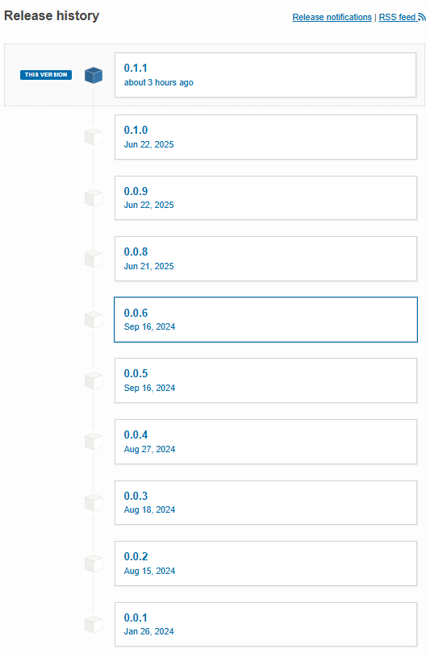
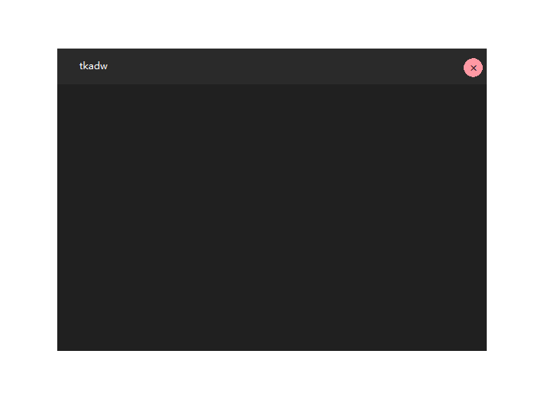
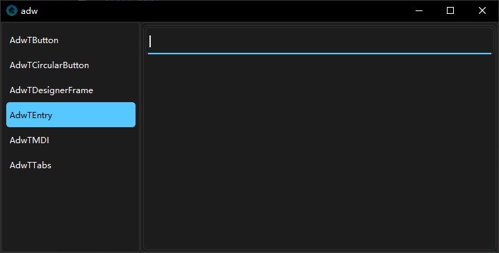

# 关于tkfluent

## 前言
这个项目首次启用，大概在`2024年1月多`，但由于我当时是一位`初中生`，还有繁重的学业要弄，便搁置下来。偶尔更新几次。



如今我终于是中考完，毕业了，暑假这段时间有大把时间来编程。

## 设计
### tkfluent的原理
`tksvg`可以在`tkinter`显示`svg`图片，然后有了个灵感，生成个`svg`图片，然后用`tksvg`将其显示在画布上。

!!! note ""
    其实早在几年前，大概`2023年`时就有这个想法，但是由于不太熟悉`Python`、`tkinter`，导致`svg`迟迟也无法显示到窗口上，后面就放弃了。
    现在才发现原来是需要实例化`SvgImage`才能让它不被销毁。

``` mermaid
graph LR
  A[SvgWrite 生成SVG图片] --> B[保存至临时文件夹];
  B --> C[tksvg.SvgImage 读取该SVG图片];
  C --> D[tkinter.Canvas.create_image 显示该图片]; 
```

!!! example "比如FluButton"
    
    因为`tkinter`的`Canvas`组件无法实现圆角矩形，所以只能用`svg`图片实现。svg绘制文本有点复杂，所以我干脆用`Canvas.create_text`来绘制文本。

    ``` mermaid
    graph LR
        A[SvgWrite 绘制圆角矩形并保持绘制临时文件夹] --> B[tksvg.SvgImage 在临时文件夹读取该SVG图片];
        B --> C[tkinter.Canvas.create_image 显示该图片];
        C --> D[tkinter.Canvas.create_text 绘制文字]; 
    ```

### 作者的前项目tkadwite
我曾经做过`tkadwite`项目，这也是个`tkinter`界面扩展库，但做到后面有点难受，因为里面的组件都是用`tkinter.Canvas`来绘制的，明显锯齿这个原因一直都在，圆角矩形的渐变、阴影都是座座大山，难以增进画面效果。



不过下面这种图片的效果，这个版本至今也没发布出来


